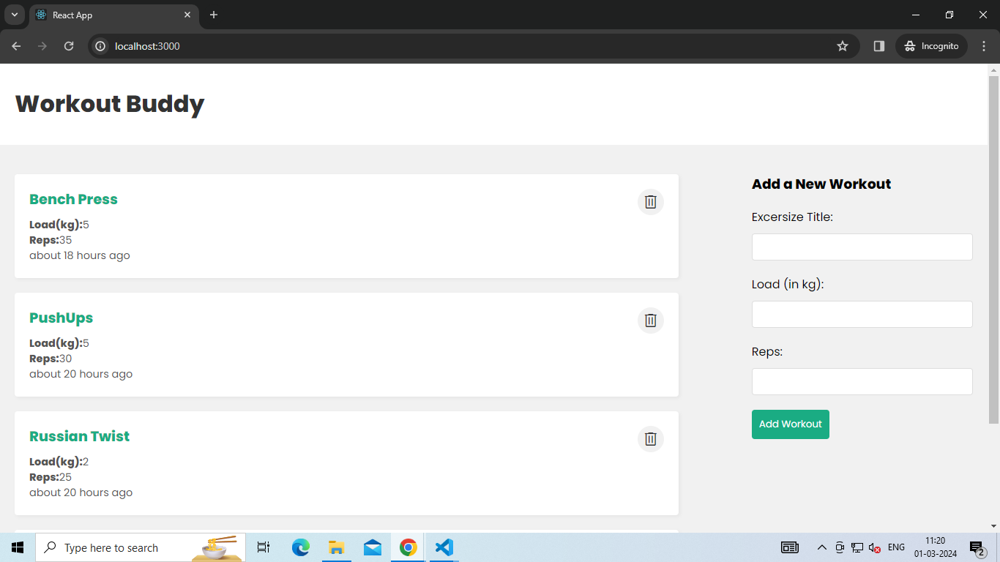

# Workout_website
Workout tracking interface, where users can log various exercises they have completed along with the load (weight) used and the number of repetitions 
performed. Users can add new workouts by inputting the exercise title, load (in kilograms), and number of repetitions, and then clicking on the "Add Workout" 
button. Each logged workout entry includes details such as the exercise name, load, reps, and the time it was recorded, allowing users to monitor their 
progress over time. Additionally, the page provides options to delete previously logged workouts, giving users control over their workout history. 
Overall, the functionality of the page seems to facilitate easy tracking and management of workout routines.
This repository is meant for learning purpose and there are no intentions of plagiarism.

